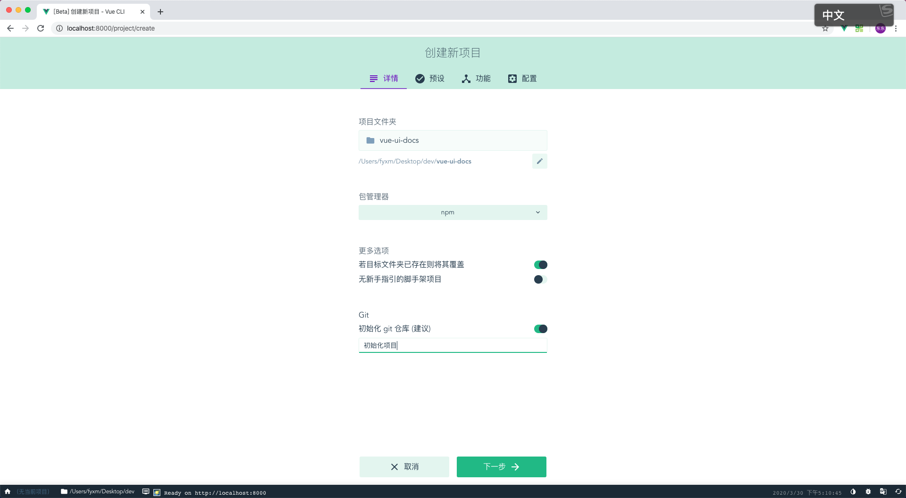
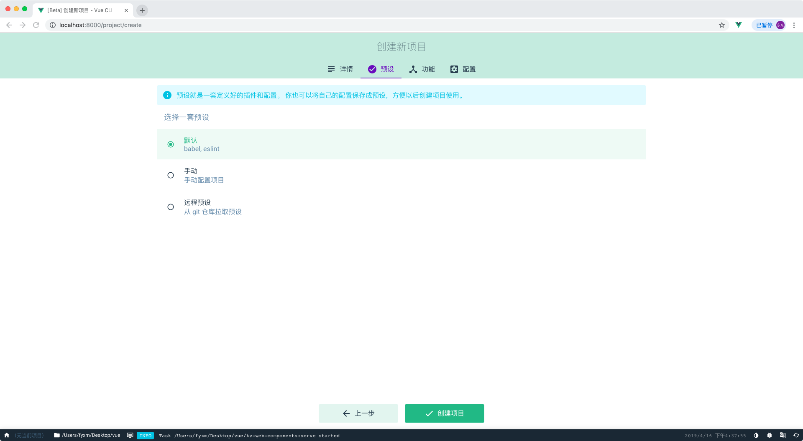
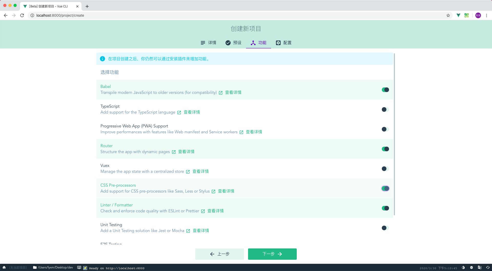
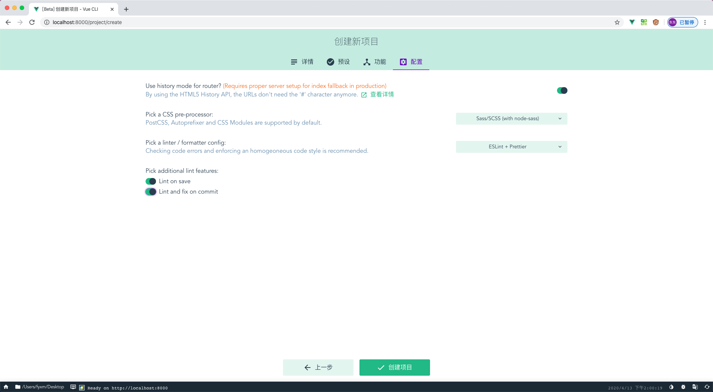
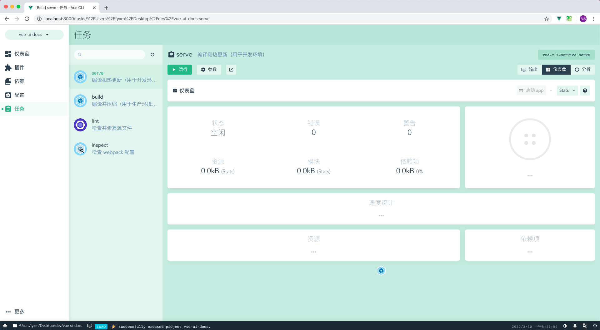
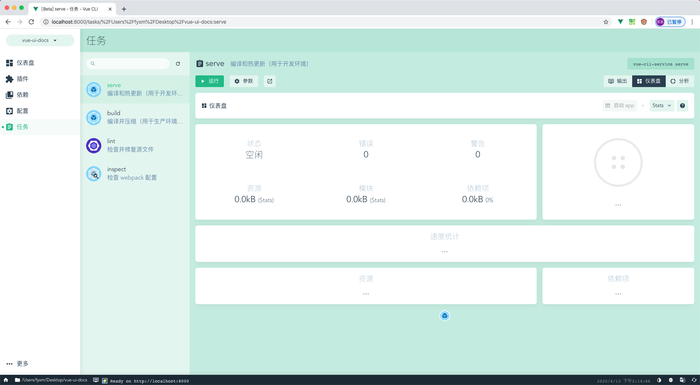
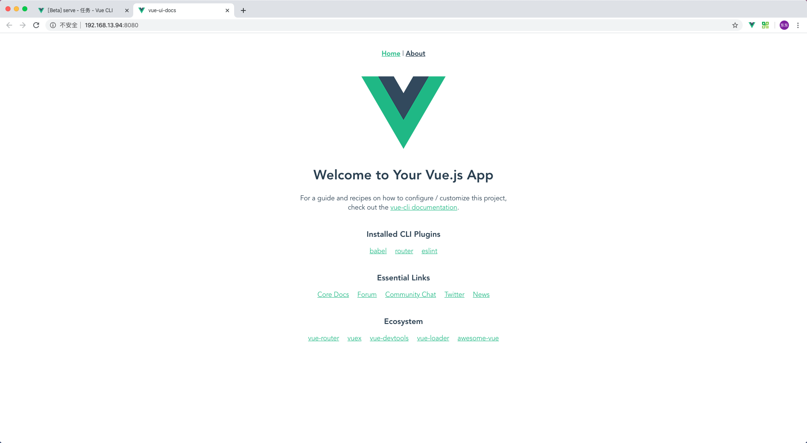
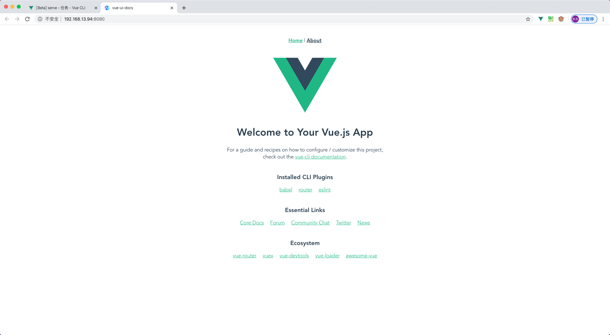
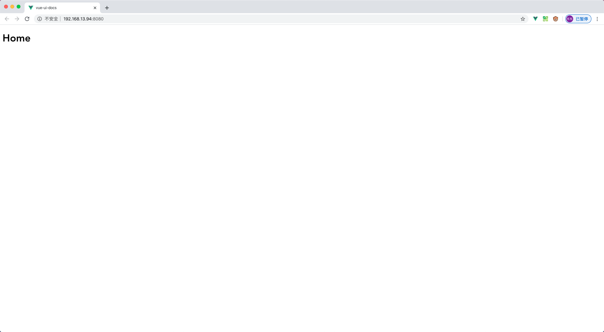
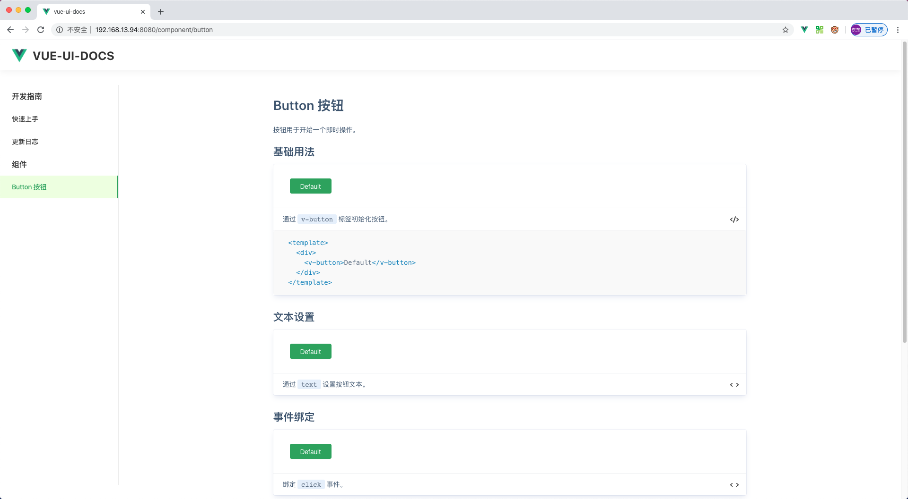

# VUE-UI-DOCS

## 创建项目

1. 全局安装 `Vue CLI` 更多内容查看[官方文档](https://cli.vuejs.org/zh/guide/installation.html)

```bash
npm install -g @vue/cli
```

2. `vue ui` 可视化操作,也可以通过 `vue crate {project}`

```bash
vue ui
```


3. 创建项目



4. 预设配置



5. 手动配置



6. 详细配置



7. 安装依赖



8. 启动项目



9. 访问地址



10. 浏览器访问



## 结构调整

1. 文件结构调整

```javascript
├─site          //示例网站目录
│ └─components  //示例网站组件
│ └─router      //路由配置
│ │ └─index.js  //路由配置文件
│ └─views       //示例页面
│ │ └─Home.vue  //示例网站首页
│ └─App.vue     //项目入口
│ └─main.js     //启动文件
├─src           //源码目录
```

2. 根目录创建 `vue.config.js` 配置

```javascript
module.exports = {
  pages: {
    index: {
      entry: "site/main.js"
    }
  }
};
```

3. 相关的依赖、路由配置进行调整，`Home.vue` 页面调整

```vue
<template>
  <h1>Home</h1>
</template>

<script>
export default {
  name: "Home"
};
</script>
```

4. 页面访问



## 组件开发

1. `Button` 组件开发

```html
<template>
  <button v-bind="$attrs" class="v-button" type="button" @click="handleClick">
    <span class="v-buttov--text">
      <slot>{{ text }}</slot>
    </span>
  </button>
</template>

<script>
  export default {
    name: "VButton",
    props: {
      text: String
    },
    methods: {
      handleClick(event) {
        this.$emit("click", event);
      }
    }
  };
</script>

<style lang="scss">
  .v-button {
    position: relative;
    display: inline-block;
    font-weight: 400;
    white-space: nowrap;
    text-align: center;
    background-image: none;
    border: 1px solid #41a259;
    background-color: #41a259;
    box-shadow: 0 2px 0 rgba(0, 0, 0, 0.015);
    transition: all 0.3s;
    user-select: none;
    height: 32px;
    min-width: 88px;
    padding: 0 16px;
    font-size: 14px;
    border-radius: 4px;
    color: #ffffff;
    outline: 0;
    font-family: inherit;
    cursor: pointer;

    &:active,
    &:focus {
      outline: 0;
    }
  }
</style>
```

2. 安装配置 `src/button/index.js`

```javascript
import Button from "./src/button";

Button.install = Vue => {
  Vue.component(Button.name, Button);
};

export default Button;
```

3. 组件集成安装 `src/index.js`

```javascript
import Button from "./button/index.js";

const components = [Button];

const install = Vue => {
  components.forEach(component => {
    Vue.use(component);
  });
};

export default {
  install
};
```

4. 入口文件引入 `site/main.js`

```javascript
import VueUIDocs from "../src/index";
Vue.use(VueUIDocs);
```

## 文档解析

1. 文档示例组件开发 `site/components/snippet.vue` ,并且在 `site/main.js` 使用 `Vue.component` 全局注册

```html
<template>
  <div class="vc-snippet">
    <div class="vc-snippet--demo">
      <!-- 代码生成vue示例 -->
      <slot name="source" />
    </div>
    <div class="vc-snippet--desc">
      <!-- 示例描述说明 -->
      <slot name="desc" />
      <span class="vc-snippet--icon-code" @click="showCode = !showCode">
        
      </span>
    </div>
    <div v-show="showCode" class="vc-snippet--code">
      <!-- 示例代码高亮显示 -->
      <slot name="code" />
    </div>
  </div>
</template>

<script>
  import "highlight.js/styles/color-brewer.css";

  export default {
    data() {
      return {
        showCode: false
      };
    },
    computed: {
      codeIconSrc() {
        return this.showCode
          ? "https://gw.alipayobjects.com/zos/rmsportal/wSAkBuJFbdxsosKKpqyq.svg"
          : "https://gw.alipayobjects.com/zos/rmsportal/wSAkBuJFbdxsosKKpqyq.svg";
      }
    }
  };
</script>

<style lang="scss" scoped>
  .vc-snippet {
    position: relative;
    box-sizing: border-box;
    width: 100%;
    margin: 0 0 16px;
    border-radius: 4px;
    transition: all 0.2s;
    box-shadow: 0 6px 12px -2px rgba(0, 32, 128, 0.1), 0 0 0 1px #f0f2f7;
    background-color: #ffffff;
    text-align: left;
    margin-bottom: 30px;
  }

  .vc-snippet--demo {
    box-sizing: border-box;
    padding: 30px 35px;
    color: #333333;
    border-bottom: 1px solid #ebedf0;
    font-size: 12px;
  }

  .vc-snippet--desc {
    position: relative;
    box-sizing: border-box;
    width: 100%;
    min-height: 44px;
    padding: 10px 50px 10px 20px;
    font-size: 14px;
    transition: background-color 0.4s;
    line-height: 1.8;

    code {
      background: #e6effb;
      border-radius: 3px;
      color: #5e6d82;
      padding: 2px 8px;
    }
  }

  .vc-snippet--icon-code {
    position: absolute;
    right: 16px;
    bottom: 13px;
    width: 18px;
    height: 18px;
    line-height: 18px;
    text-align: center;
    cursor: pointer;

    > img {
      width: 18px;
      height: 18px;
    }
  }
  .vc-snippet--code {
    box-sizing: border-box;
    border-top: 1px solid #ebedf0;

    /deep/ {
      code {
        background: #f9f9f9;
        font-family: Consolas, Menlo, Courier, monospace;
        border: none;
        display: block;
        font-size: 14px;
        padding: 16px 32px;
        line-height: 1.5;
      }

      .hljs {
        padding: 0;
        margin: 0;
      }
    }
  }
</style>
```

2. `build/markdown-loader.js` 解析 marokdown 为 vue 文件，并且自定义解析代码块 `:::snippet {content} :::`

```javascript
const MarkdownIt = require("markdown-it");
const MarkdownItContainer = require("markdown-it-container");
const VueTemplateComplier = require("vue-template-compiler");
const hljs = require("highlight.js");
const { parse, compileTemplate } = require("@vue/component-compiler-utils");

module.exports = function(source) {
  // 需要解析成vue代码块集合
  const componentCodeList = [];
  let styleCodeList = [];
  const globalScript = [];
  // 初始还MarkdownIt用于转换md文件为html
  const markdownIt = MarkdownIt({
    html: true,
    xhtmlOut: true,
    // 将markdown中的代码块用hljs高亮显示
    highlight: function(str, lang) {
      if (lang && hljs.getLanguage(lang)) {
        return `<pre class="hljs"><code>${
          hljs.highlight(lang, str, true).value
        }</code></pre>`;
      }
      return `<pre class="hljs"><code>${markdownIt.utils.escapeHtml(
        str
      )}</code></pre>`;
    }
  });
  // 解析【:::tip:::】
  markdownIt.use(MarkdownItContainer, "tip");
  // 解析【:::warning:::】
  markdownIt.use(MarkdownItContainer, "warning");
  // 使用【markdown-it-container】插件解析【:::snippet :::】代码块为vue渲染
  markdownIt.use(MarkdownItContainer, "snippet", {
    // 验证代码块为【:::snippet :::】才进行渲染
    validate(params) {
      return params.trim().match(/^snippet\s*(.*)$/);
    },
    // 代码块渲染
    render(tokens, index) {
      const token = tokens[index];
      const tokenInfo = token.info.trim().match(/^snippet\s*(.*)$/);
      if (token.nesting === 1) {
        // 获取snippet第一行的表述内容
        const desc = tokenInfo && tokenInfo.length > 1 ? tokenInfo[1] : "";
        // 获取vue组件示例的代码
        const nextIndex = tokens[index + 1];
        let content = nextIndex.type === "fence" ? nextIndex.content : "";
        if (!/^<template>/.test(content)) {
          content = `<template><div>${content}</div></template>`;
        }

        // 将content解析为vue组件基本属性对象;
        let { template, script, styles } = parse({
          source: content,
          compiler: VueTemplateComplier,
          needMap: false
        });
        styleCodeList = styleCodeList.concat(styles);
        // 将template的转为render函数
        const { code } = compileTemplate({
          source: template.content,
          compiler: VueTemplateComplier
        });
        // 获取script的代码
        script = script ? script.content : "";
        if (script) {
          const [global, content] = script.split(/export\s+default/);
          globalScript.push(global.trim());
          script = `const exportJavaScript = ${content}`;
        } else {
          script = "const exportJavaScript = {};";
        }
        // 代码块解析将需要解析vue组件的存储，渲染html用组件名称替代
        const name = `vc-snippent-${componentCodeList.length}`;
        // 渲染组件代码添加到数据集合
        componentCodeList.push(`"${name}":(function () {
          ${code}
          ${script}
           return {
             ...exportJavaScript,
             render,
             staticRenderFns
          }
        })()`);
        // 将需要渲染的示例用vc-snippet组件包裹替换插槽显示示例效果
        return `<vc-snippet>
                  <div slot="desc">${markdownIt.render(desc)}</div>
                  <${name} slot="source" />
                  <div slot="code">`;
      }
      return `    </div>
                </vc-snippet> `;
    }
  });
  // 将所有转换好的代码字符串拼接成vue单组件template、script、style格式
  return `
        <template>
          <div class="vc-snippet-doc">
            ${markdownIt.render(source)}
          </div>
        </template>
        <script>
           ${globalScript.join(" ")}
           export default {
           name: 'vc-component-doc',
           components: {
            ${componentCodeList.join(",")}
           }
         }
       </script>
       <style lang='scss'>
         ${Array.from(styleCodeList, m => m.content).join("\n")}
       </style>`;
};
```

3. `vue.config.js` 配置 `webpack` 加载器解析 `.md` 文件

```javascript
module.exports = {
  pages: {
    index: {
      // 入口文件
      entry: "site/main.js"
    }
  },
  chainWebpack: config => {
    // 解析Markdown文件转成vue组件
    config.module
      .rule("md")
      .test(/\.md/)
      .use("vue-loader")
      .loader("vue-loader")
      .options({
        compilerOptions: {
          preserveWhitespace: false
        }
      })
      .end()
      .use("markdown-loader")
      .loader(require("path").resolve(__dirname, "./build/markdown-loader.js"))
      .end();
  }
};
```

4. 文档编写 `src/button/index.md`

````markdown
# Button 按钮

按钮用于开始一个即时操作。

## 基础用法

:::snippet 通过 `v-button` 标签初始化按钮。

```html
<template>
  <div>
    <v-button>Default</v-button>
  </div>
</template>
```

:::

## 文本设置

:::snippet 通过 `text` 设置按钮文本。

```html
<template>
  <div>
    <v-button text="Default"></v-button>
  </div>
</template>
```

:::

## 事件板顶

:::snippet 绑定 `click` 事件。

```html
<template>
  <div>
    <v-button text="Default" @click="handleButtonClick"></v-button>
  </div>
</template>

<script>
  export default {
    methods: {
      handleButtonClick() {
        alert(1);
      }
    }
  };
</script>
```

:::

## Button Attributes

| 参数 | 说明     | 类型   | 可选值 | 默认值 |
| ---- | -------- | ------ | ------ | ------ |
| text | 按钮文本 | String | —      | —      |

## Button Events

| 事件名称 | 说明     | 回调参数 |
| -------- | -------- | -------- |
| click    | 单击触发 | event    |

## Button Slots

| 名称 | 说明     |
| ---- | -------- |
| —    | 按钮内容 |
````

5. 路由配置

```javascript
 ...
 {
   path: "/component/button",
   name: "component-button",
   component: () => import("../../src/button/index.md")
 }
 ...
```

6. 浏览器访问


