# vue-ui-docs

## Description

### 从 Vue-cli 开始构建 UI 库到 Markdown 生成文档和演示案例

## vue-cli 3.0 环境配置

### [vue.config.js](src/vue.config.js)

## Overview

### [shui.kitorv.com](http://shui.kitorv.com)

## 项目搭建

### 1. vue-cli 环境搭建

- 打开`cmd`命令工具，输入`npm install -g vue-cli`全局安装 vue-cli

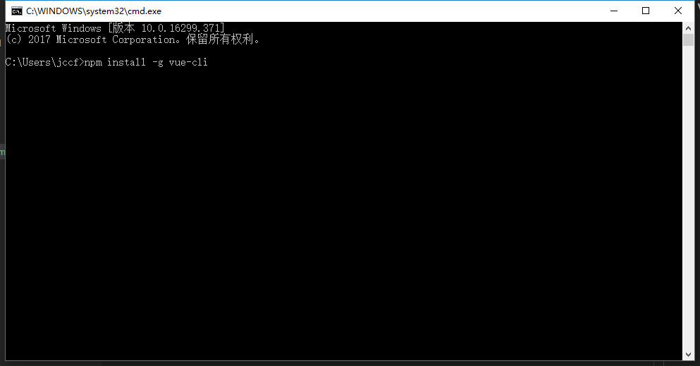

- 安装过程慢，切换到淘宝镜像源`npm config set registry https://registry.npm.taobao.org`

### 2. 构建 vue-cli 项目

- 打开`cmd`，进入想要创建项目的目录下，输入：`vue init webpack images`,回车

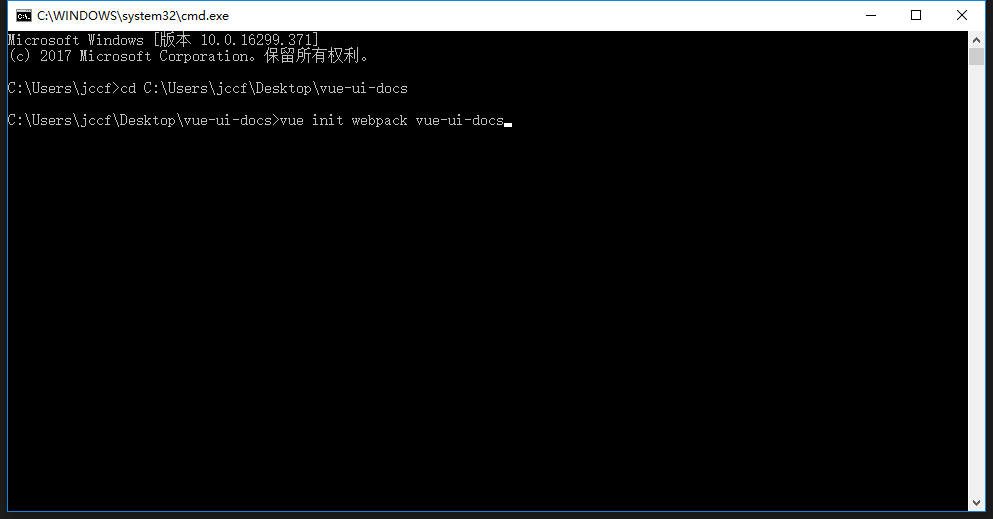

- 等待初始化完成根据控制台输入命令完成接下去的操作

  - Project name:——项目名称
  - Project description:——项目描述
  - Author:——作者
  - Vue build:——构建模式，一般默认选择第一种
  - Install vue-router?:——是否安装引入 vue-router，这里选是，vue-router 是路由组件,后面构建项目会用到
  - Use ESLint to lint your code?:——这里强烈建议选 no 否则你会非常痛苦，eslint 的格式验证非常严格，多一个空格少一个空格都会报错，所以对于新手来说，一般不建议开启，会加大开发难度
  - Setup unit tests with Karma + Mocha ：——测试可以不安装
  - Setup e2e tests with Nightwatch ：——测试可以不安装

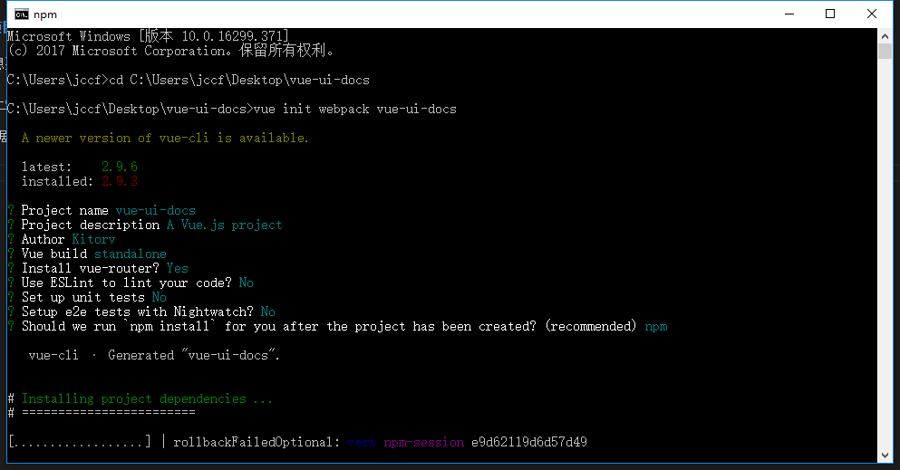

### 3. 构建完成初始化项目依赖

- 初始化完成目录结构

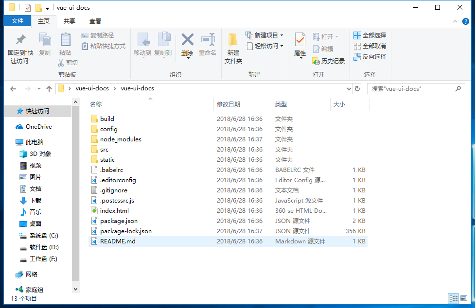

- 切换到目录 `cd C:\Users\jccf\Desktop\images`,执行命令`npm install`

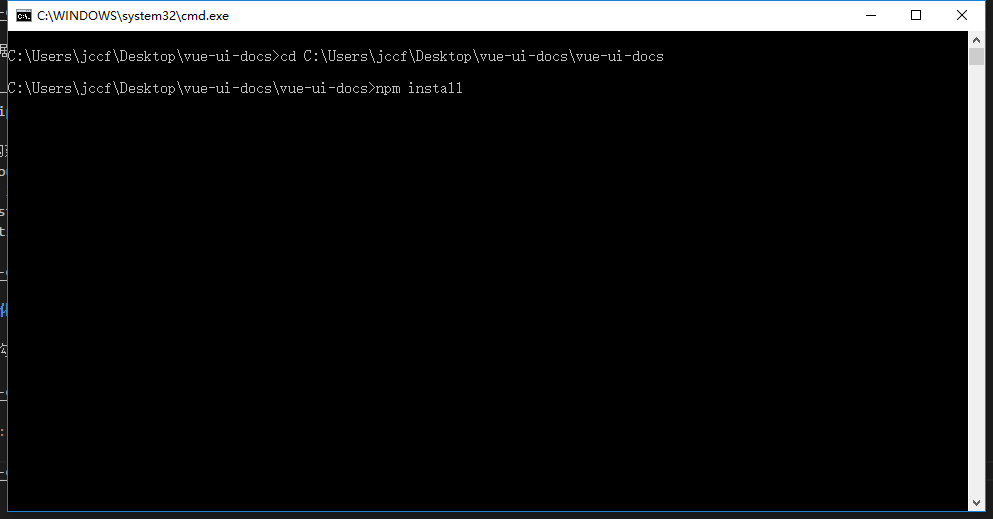

- 开始安装依赖环境

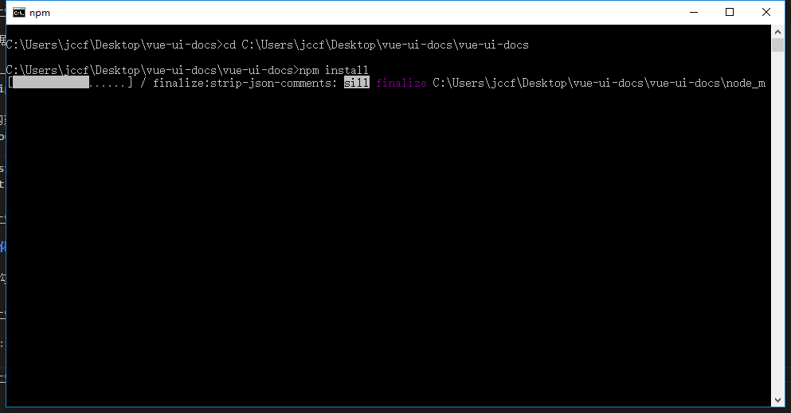

- 依赖环境安装完成

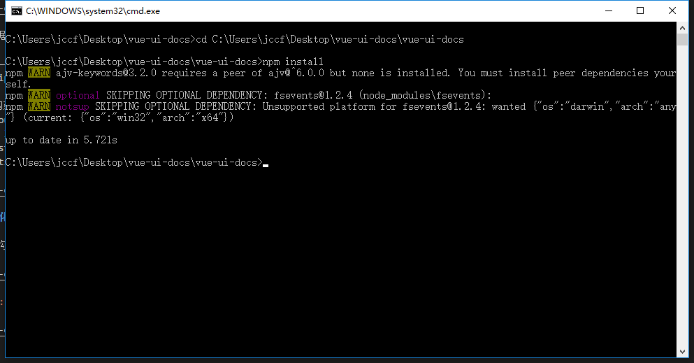

### 4. 启动项目

- 打开`cmd`，进入到项目所在目录下，输入`npm run dev`,回车，启动项目

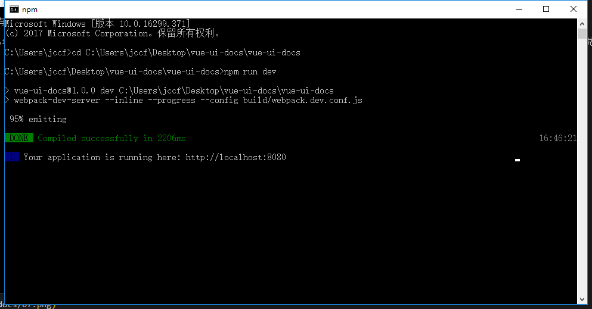

- 打开浏览器输入`http://localhost:8080`访问

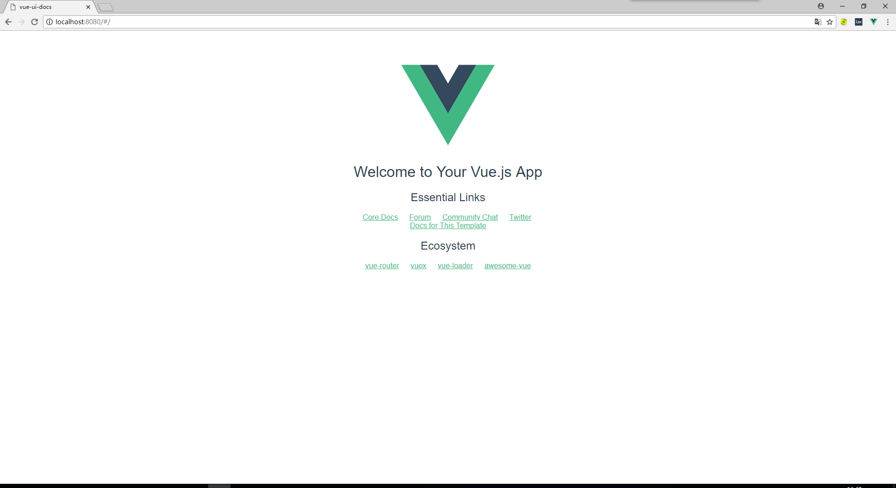

### 5. 环境调整

- 目录结构调整和文件创建

```JavaScript
├─examples  // 原 src 目录，改成 examples 用作示例展示
│  │  App.vue //主页文件
│  │  main.js //项目入口文件
│  │
│  ├─docs //markdown帮助文档文件夹
│  │
│  └─router
│          index.js //路由配置文件
│
├─src // 新增 src 用于编写存放组件
│  │  index.js  //组件集成统一访问文件配置
│  │
│  ├─components  //组件文件夹
│  ├─directives //自定义指令文件夹
│  ├─mixins //混入文件
│  └─styles //样式文件夹
```

- 由于目录调整需要调整对应的`webpack`配置才可以启动项目

  - 删除`examples\router\index.js`的无效代码
  - 找到`\build\webpack.base.conf.js`文件进行配置调整
  - 修改`webpack`的主文件入口

  ```JavaScript
  entry: {
    app: './examples/main.js',
  }
  ```

  - 修改`webpack`编译配置

  ```JavaScript
  {
    test: /\.js$/,
    loader: 'babel-loader',
    include: [resolve('examples'), resolve('src')]
  }
  ```

  - 修改`App.vue`的代码和引用
  - 启动项目`npm run dev`有错误就根据错误调整，直到可以正常访问不在报错

### 6. 解析`markdown`文件

- 通过`markdown`写帮助文档然后解析为页面，参考`饿了么UI` 组件库的使用 [vue-markdown-loader](https://github.com/QingWei-Li/vue-markdown-loader)
  将`markdown`文件解析为`vue`组件直接页面渲染,安装`vue-markdown-loader`直接执行命令
  > npm install vue-markdown-loader --save-dev
- 配置`webpack`加载器解析`markdown`，在`vue-loader.conf.js`在属性`rules`追加配置加载器

```JavaScript
module.exports = {
  module: {
    rules: [
      {
        test: /\.md$/,
        loader: 'vue-markdown-loader'
      }
    ]
  }
};
```

- 在`docs`文件下创建第一个`markdown`文件，`test.md`

```html
# test > Hello World
```

- 配置路由

```JavaScript
  routes: [{
    path: '/test',
    name: 'test',
    component: r => require.ensure([], () => r(require('../docs/test.md')))
  }]
```

- 浏览器访问`http://localhost:8080/#/test`,正确的将`markdown`解析为 vue 组件并正确初始化路由

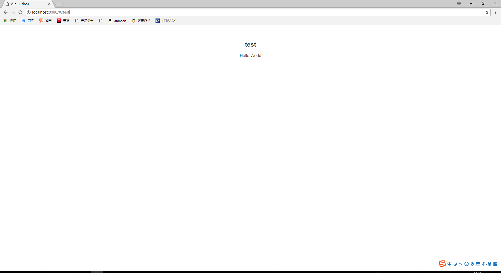

### 7. 解析代码块和示例生成

- 代码块示例

````html
:::demo ### 描述标题 ```html
<template>
  
</template>
<script>
  console.log(1)
</script>
``` ::: ```
````

- 将示例的`markdown`编译成以下效果

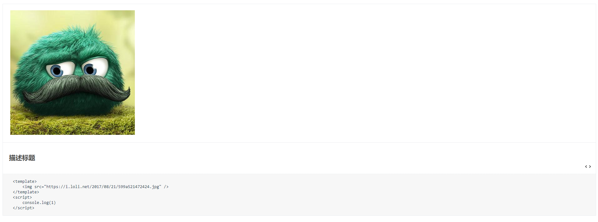
上面为`代码执行示例`，`中间为描述信息`，`底部为代码示例`

- 开发一个`demo-block`用于显示代码块的组件

```html
<template>
  <div class="demo-block">
    <div class="demo-block-source">
      <slot name="source"></slot>
      <span class="demo-block-code-icon" v-if="!$slots.default" @click="showCode=!showCode"
        ></span>
    </div>
    <div class="demo-block-meta" v-if="$slots.default">
      <slot></slot>
      <span v-if="$slots.default" class="demo-block-code-icon" @click="showCode=!showCode"
        ></span>
    </div>
    <div class="demo-block-code" v-show="showCode"><slot name="highlight"></slot></div>
  </div>
</template>
<script type="text/babel">
  export default {
    data() {
      return {
        showCode: false
      }
    }
  }
</script>
<style>
  .demo-block {
    border: 1px solid #ebedf0;
    border-radius: 2px;
    display: inline-block;
    width: 100%;
    position: relative;
    margin: 0 0 16px;
    -webkit-transition: all 0.2s;
    transition: all 0.2s;
    border-radius: 2px;
  }
  .demo-block p {
    padding: 0;
    margin: 0;
  }
  .demo-block .demo-block-code-icon {
    position: absolute;
    right: 16px;
    bottom: 14px;
    cursor: pointer;
    width: 18px;
    height: 18px;
    line-height: 18px;
    text-align: center;
  }
  .demo-block .demo-block-code-icon img {
    -webkit-transition: all 0.4s;
    transition: all 0.4s;
    -webkit-user-select: none;
    -moz-user-select: none;
    -ms-user-select: none;
    user-select: none;
    position: absolute;
    left: 0;
    top: 0;
    margin: 0;
    max-width: 100%;
    width: 100%;
    vertical-align: baseline;
    -webkit-box-shadow: none;
    box-shadow: none;
  }
  .demo-block .demo-block-source {
    border-bottom: 1px solid #ebedf0;
    padding: 20px 24px 20px;
    color: #444;
    position: relative;
    margin-bottom: -1px;
  }
  .demo-block .demo-block-meta {
    position: relative;
    padding: 12px 50px 12px 20px;
    border-radius: 0 0 2px 2px;
    -webkit-transition: background-color 0.4s;
    transition: background-color 0.4s;
    width: 100%;
    -webkit-box-sizing: border-box;
    box-sizing: border-box;
    font-size: 14px;
    color: #444;
    font-size: 14px;
    line-height: 2;
    border-radius: 0;
    border-bottom: 1px dashed #ebedf0;
    margin-bottom: -1px;
  }
  .demo-block .demo-block-meta code {
    color: #444;
    background-color: #e6effb;
    margin: 0 4px;
    display: inline-block;
    padding: 3px 7px;
    border-radius: 3px;
    height: 18px;
    line-height: 18px;
    font-family: Menlo, Monaco, Consolas, Courier, monospace;
    font-size: 14px;
  }
  .demo-block .demo-block-code {
    background-color: #f7f7f7;
    font-size: 0;
  }
  .demo-block .demo-block-code code {
    background-color: #f7f7f7;
    font-family: Consolas, Menlo, Courier, monospace;
    border: none;
    display: block;
    font-size: 14px;
    padding: 16px 32px;
  }
  .demo-block .demo-block-code pre {
    margin: 0;
    padding: 0;
  }
  .sh-checkbox {
    color: #444;
    font-weight: 500;
    font-size: 14px;
    position: relative;
    cursor: pointer;
    display: inline-block;
    white-space: nowrap;
    user-select: none;
  }
</style>
```

- `vue-markdown-loader`依赖了`highlight`在`App.vue`的样式中引用进行代码着色，风格参照`highlight.js`自己引用

```css
@import "highlight.js/styles/color-brewer.css";
```

- 在`main.js`配置全局安装组件，让每个`md`文件都可以自动编译成 vue 组件并且渲染代码块

```javascript
import DemoBlock from "./components/demo-block.vue"
Vue.component("demo-block", DemoBlock)
```

- `webpack.base.conf.js`配置`vue-markdown-loader`的`options`属性
  - 将`demo`代码块解析，在 markdown 用`demo-block`组件包裹
  - 安装`npm install markdown-it-container --save-dev`
  - 对 options 进行配置完成效果渲染

```javascript
const markdownRender = require('markdown-it')();

{
  test: /\.md$/,
  loader: 'vue-markdown-loader',
  options: {
    preventExtract: true,
    use: [
      [require('markdown-it-container'), 'demo', {

        validate: function (params) {
          return params.trim().match(/^demo\s+(.*)$/);
        },

        render: function (tokens, idx) {
          if (tokens[idx].nesting === 1) {
            // 1.获取第一行的内容使用markdown渲染html作为组件的描述
            let demoInfo = tokens[idx].info.trim().match(/^demo\s+(.*)$/);
            let description = (demoInfo && demoInfo.length > 1) ? demoInfo[1] : '';
            let descriptionHTML = description ? markdownRender.render(description) : '';
            // 2.获取代码块内的html和js代码
            let content = tokens[idx + 1].content;
            // 3.使用自定义开发组件【DemoBlock】来包裹内容并且渲染成案例和代码示例
            return `<demo-block>
            <div class="source" slot="source">${content}</div>
            ${descriptionHTML}
            <div class="highlight" slot="highlight">`;
          } else {
            return '</div></demo-block>\n';
          }
        }
      }]
    ]

  }
}
```

- 重新运行`npm run dev`得到预期的效果

- 对`App.vue`样式和排版布局进行调整
  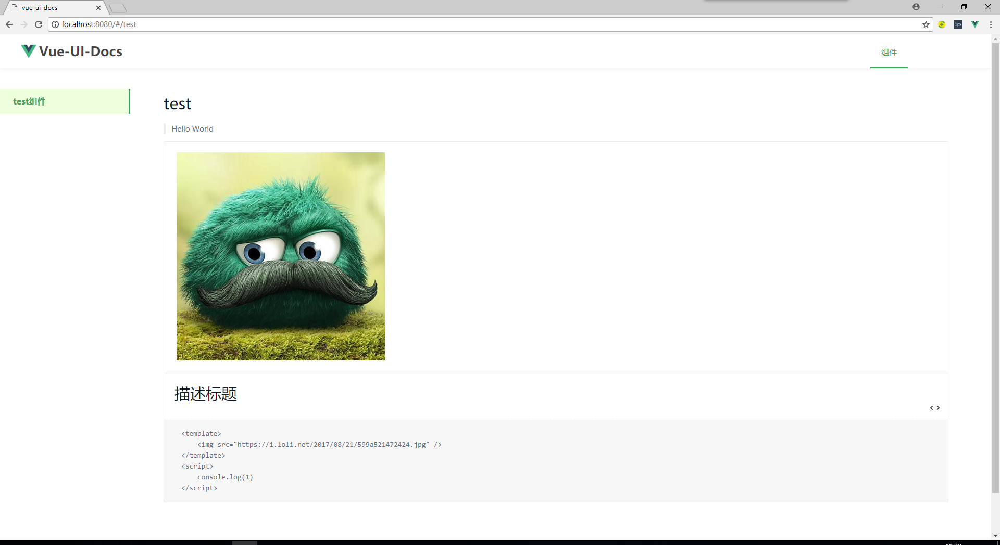

### 8. 开发第一个组件

- 开发一个按钮组件，在`src\components`下开发`kt-button.vue`按钮组件

```html
<template>
  <div class="kt-button"><slot></slot></div>
</template>
<script>
  export default {
    name: "KtButton"
  }
</script>
<style>
  .kt-button {
    border: 1px solid #41a259;
    background-color: #41a259;
    display: inline-block;
    border-radius: 2px;
    height: 14px;
    line-height: 14px;
    color: #fff;
    padding: 10px 19px;
    cursor: pointer;
    white-space: nowrap;
  }
</style>
```

- 在`examples\docs`下创建`button.md`进行文档编写和代码示例

````html
# Button 按钮 ## 基础用法 :::demo 通过`plain`属性可以设置为朴素的按钮 ```html
<kt-button>确认</kt-button>
``` ::: ```
````

- 路由配置

```javascript
export default new Router({
  routes: [
    {
      path: "/test",
      name: "test",
      component: r => require.ensure([], () => r(require("../docs/test.md")))
    },
    {
      path: "/button",
      name: "button",
      component: r => require.ensure([], () => r(require("../docs/button.md")))
    }
  ]
})
```

- 首页链接配置

```html
<router-link to="/button">button 组件</router-link>
```

- 配置`src`下的的`index.js`

```javascript
import KtButton from "./components/kt-button.vue"

const components = [KtButton]

export default function(Vue) {
  components.map(component => {
    Vue.component(component.name, component)
  })
}
```

- `main.js`安装所有的组件，让所有的`docs`下的`md`文件都可以调用

```javascript
import install from "../src/index"
install(Vue)
```

- 效果预览，组件开发完成
  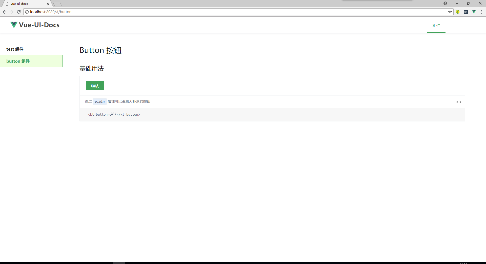
