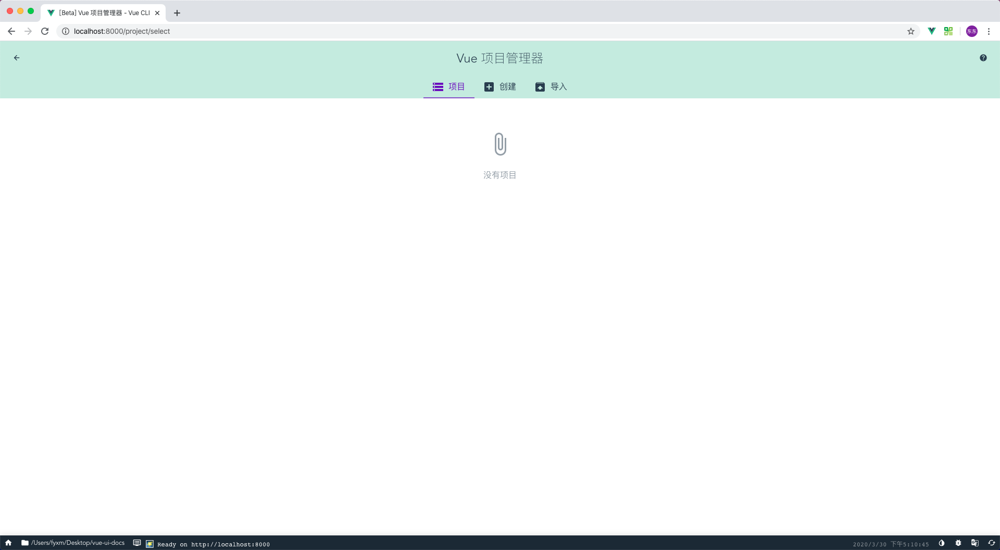

# vue-ui-docs

## 介绍

VueCli+Markdown+Travis 自定解析组件库 Markdown 示例，自动发布到 Npm 和 github pages。

## Vue 项目创建

1. 安装 Vue CLI

```bash
npm install -g @vue/cli
```

2. 启动 vue ui 可视化操作创建项目

```bash
vue ui
```



3. 创建项目


4. 手动配置


5. 项目配置


6. 自定义配置


7. 启动项目


8. 项目运行


9. 在线访问


:::
